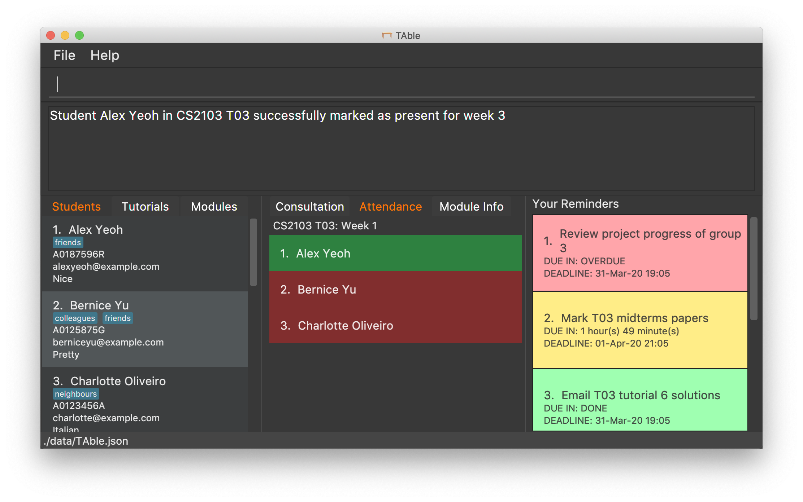

= TAble
ifdef::env-github,env-browser[:relfileprefix: docs/]

_TAble Teaching Assistant Tool_

https://api.travis-ci.org/AY1920-CS2103-W15-3/main[image:https://travis-ci.org/AY1920S2-CS2103-W15-3/main.svg?branch=master[build status]]
https://coveralls.io/github/AY1920S2-CS2103-W15-3/main?branch=master[image:https://coveralls.io/repos/github/AY1920S2-CS2103-W15-3/main/badge.svg?branch=master[Coverage Status]]

ifdef::env-github[]

endif::[]

ifndef::env-github[]
image::images/Ui.png[width="600"]
endif::[]

* Have you ever had trouble keeping track of your tutorials and students as a TA in NUS? TAble is your handy desktop app, optimized for TAs who prefer to work with a Command Line Interface (CLI) while still having the benefits of a Graphical User Interface (GUI)! Mark attendance, arrange consults, add module notes, set reminders and more with TAble!

== Site Map

* <<UserGuide#, User Guide>>
* <<DeveloperGuide#, Developer Guide>>
* <<AboutUs#, About Us>>
* <<ContactUs#, Contact Us>>

== Acknowledgements

* Some parts of this sample application were inspired by the excellent http://code.makery.ch/library/javafx-8-tutorial/[Java FX tutorial] by
_Marco Jakob_.
* Libraries used: https://github.com/controlsfx/controlsfx[ControlsFX], https://openjfx.io/[JavaFX], https://github.com/FasterXML/jackson[Jackson], https://github.com/junit-team/junit5[JUnit5]
* The original source of the code AddressBook-Level 3 project was created by SE-EDU initiative at https://se-education.org

== Licence : link:LICENSE[MIT]
