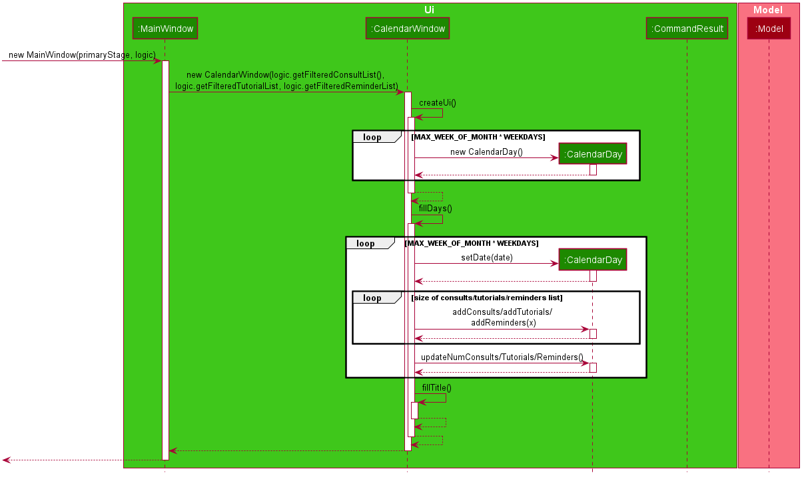

= TAble - Developer Guide
:site-section: DeveloperGuide
:toc:
:toc-title:
:toc-placement: preamble
:sectnums:
:imagesDir: images
:stylesDir: stylesheets
:xrefstyle: full
:experimental:
ifdef::env-github[]
:tip-caption: :bulb:
:note-caption: :information_source:
:warning-caption: :warning:
endif::[]
:repoURL: https://github.com/AY1920-CS2103-W15-3/main/master

By: `AY1920-CS2103-W15-3`      Since: `Apr 2020`      Licence: `MIT`

== Setting up

Refer to the guide <<SettingUp#, here>>.

== Design

[[Design-Architecture]]
=== Architecture

.Architecture Diagram
image::ArchitectureDiagram.png[]

The *_Architecture Diagram_* given above explains the high-level design of the App. Given below is a quick overview of each component.

[TIP]
The `.puml` files used to create diagrams in this document can be found in the link:{repoURL}/docs/diagrams/[diagrams] folder.
Refer to the <<UsingPlantUml#, Using PlantUML guide>> to learn how to create and edit diagrams.

`Main` has two classes called link:{repoURL}/src/main/java/seedu/address/Main.java[`Main`] and link:{repoURL}/src/main/java/seedu/address/MainApp.java[`MainApp`]. It is responsible for,

* At app launch: Initializes the components in the correct sequence, and connects them up with each other.
* At shut down: Shuts down the components and invokes cleanup method where necessary.

<<Design-Commons,*`Commons`*>> represents a collection of classes used by multiple other components.
The following class plays an important role at the architecture level:

* `LogsCenter` : Used by many classes to write log messages to the App's log file.

The rest of the App consists of four components.

* <<Design-Ui,*`UI`*>>: The UI of the App.
* <<Design-Logic,*`Logic`*>>: The command executor.
* <<Design-Model,*`Model`*>>: Holds the data of the App in-memory.
* <<Design-Storage,*`Storage`*>>: Reads data from, and writes data to, the hard disk.

Each of the four components

* Defines its _API_ in an `interface` with the same name as the Component.
* Exposes its functionality using a `{Component Name}Manager` class.

For example, the `Logic` component (see the class diagram given below) defines it's API in the `Logic.java` interface and exposes its functionality using the `LogicManager.java` class.

.Class Diagram of the Logic Component
image::LogicClassDiagram.png[]

[discrete]
==== How the architecture components interact with each other

The _Sequence Diagram_ below shows how the components interact with each other for the scenario where the user issues the command `delete 1`.

.Component interactions for `delete 1` command
image::ArchitectureSequenceDiagram.png[]

The sections below give more details of each component.

[[Design-Ui]]
=== UI component

.Structure of the UI Component
image::UiClassDiagram.png[]

*API* : link:{repoURL}/src/main/java/seedu/address/ui/Ui.java[`Ui.java`]

The UI consists of a `MainWindow` that is made up of parts e.g.`CommandBox`, `ResultDisplay`, `StudentListPanel`, `ConsultListPanel`, `StatusBarFooter` etc. All these, including the `MainWindow`, inherit from the abstract `UiPart` class.

The `UI` component uses JavaFx UI framework. The layout of these UI parts are defined in matching `.fxml` files that are in the `src/main/resources/view` folder. For example, the layout of the link:{repoURL}/src/main/java/seedu/address/ui/MainWindow.java[`MainWindow`] is specified in link:{repoURL}/src/main/resources/view/MainWindow.fxml[`MainWindow.fxml`]

The `UI` component,

* Executes user commands using the `Logic` component.
* Listens for changes to `Model` data so that the UI can be updated with the modified data.

[[Design-Logic]]
=== Logic component

[[fig-LogicClassDiagram]]
.Structure of the Logic Component
image::LogicClassDiagram.png[]

*API* :
link:{repoURL}/src/main/java/seedu/address/logic/Logic.java[`Logic.java`]

.  `Logic` uses the `TAbleParser` class to parse the user command.
.  This results in a `Command` object which is executed by the `LogicManager`.
.  The command execution can affect the `Model` (e.g. adding a student).
.  The result of the command execution is encapsulated as a `CommandResult` object which is passed back to the `Ui`.
.  In addition, the `CommandResult` object can also instruct the `Ui` to perform certain actions, such as displaying help to the user.

Given below is the Sequence Diagram for interactions within the `Logic` component for the `execute("delete 1")` API call.

.Interactions Inside the Logic Component for the `delete 1` Command
image::DeleteSequenceDiagram.png[]

NOTE: The lifeline for `DeleteCommandParser` should end at the destroy marker (X) but due to a limitation of PlantUML, the lifeline reaches the end of diagram.

[[Design-Model]]
=== Model component

.Structure of the Model Component
image::ModelClassDiagram.png[]

*API* : link:{repoURL}/src/main/java/seedu/address/model/Model.java[`Model.java`]

The `Model`,

* stores a `UserPref` object that represents the user's preferences.
* stores the data of Students, and other data sources named as `{component}TAble` e.g. `ModTAble`.
* exposes an unmodifiable `ObservableList<Student>` that can be 'observed' e.g. the UI can be bound to this list so that the UI automatically updates when the data in the list change.
* does not depend on any of the other three components.

[[Design-Storage]]
=== Storage component

.Structure of the Storage Component
image::StorageClassDiagram.png[]

*API* : link:{repoURL}/src/main/java/seedu/address/storage/Storage.java[`Storage.java`]

The `Storage` component,

* can save `UserPref` objects in json format and read it back.
* can save the TAble data in json format and read it back.

[[Design-Commons]]
=== Common classes

Classes used by multiple components are in the `seedu.address.commons` package.

== Implementation

This section describes some noteworthy details on how certain features are implemented.

// tag::module[]
=== Module feature (Written by Nigel Neo)
*TAble* allows NUS SoC teaching assistants to track and record all modules that they are teaching. Users can leave notes on the modules that they are teaching and store a list of links for the module that are useful for reference.

==== Implementation
A module can be stored as a Mod object in TAble (renamed due to naming restrictions on Java keywords). The main components are the module code, which is used to identify unique modules, and module name. Mod can also store the user's notes of the module through its description parameter, as well as a list of module links which are relevant to the course.

.Class diagram of 'Mod' feature, displaying only directly related classes
image::ModClassDiagram.png[]

The following sequence diagram shows how notes of a module can be updated with the `noteMod` command. Each command is parsed into a ModCode object and the note stored as string. The ModCode is then used to retrieve the appropriate Mod object in `model`. Next, this is used in the Mod constructor to come up with a new Mod with the given note. This new Mod replaces the original Mod in model and the command returns a string indicating success.

.Sequence diagram of updating Mod notes
image::NoteModSequenceDiagram.png[]

Module links are stored as ModLink objects in TAble. The collection of ModLinks are stored as `List<ModLinkPair>` (where a ModLinkPair is actually a class wrapper for a Pair<String, ModLink> object) since each module link can be described differently. This allows for more flexibility in naming the module links, rather than solely using an index based notation, and ensures that the order of addition into the collection is maintained. The activity diagram of adding module links is shown below.

.Activity diagram of adding ModLinks to Mod
image::AddModLinkActivityDiagram.png[]

Users can then view the information associated with a Mod object by using the `viewModInfo` command, and copy module links with the `copyModLink` command. Discussion on the copyModLink command is shown below.

==== Design Considerations

===== Unable to delete module with associated tutorials

[width="100%", cols="1, 5, 5"]
|===
||*Alternative 1: (Current Choice)* Disable deletion of module with associated tutorials
|*Alternative 2 :* Delete module together with its associated tutorials

|*Pros*
|Informs user if there are any dependencies between module to be deleted and tutorials in TAble.
|Fast deletion of module and related objects.

|*Cons*
|User needs to individually delete associated tutorials before module can be deleted.
|Information in TAble will be lost easily as user may not be aware of such an association. As there is no undo command, it will not be easy to undo this command and revert TAble to its original state.
|===

Reason for choosing Alternative 1: On a user design perspective, it is not advisable to delete all objects associated with module, as the user may be unaware of these associated objects. By individually confirming the objects to be deleted, the user is made more aware of any information that they may want to export or save first before deleting said information.

===== ModLink behaviour

[width="100%", cols="1, 5, 5"]
|===
||*Alternative 1: (Current Choice)* Copy link into user's clipboard
|*Alternative 2 :* Open a new browser page

|*Pros*
|Allows for easier access and sharing of link.
|Fast access to module's weblink by directly opening a browser.

|*Cons*
| User needs to open a browser before accessing link.
| Very distracting when opening link, as focus changes from TAble to browser unexpectedly (depending on when browser loads).
|===

Reason for choosing Alternative 1: On a user design perspective, it is less jarring to copy link into the user's clipboard, since the user can choose when they want to access the link and have the flexibility to share the link to others. Additionally, opening a new browser page requires more complicated code that depends on another program.

// end::module[]

// tag::tutorial[]

=== Tutorial feature (Written by Sarah Lim)
*TAble* allows NUS teaching assistants to track and record all the tutorials they are teaching, and maintain details of the tutorial, such as the module it is under, start and end time of the tutorial, and the location it is held.
Tutorials in *TAble* also allow teaching assistants to enroll students in a tutorial and mark their attendance for every week of the semester, and allows for convenient referencing (particularly when there's a pandemic and contact tracing is critical).

==== Implementation
Since a `Tutorial` in *TAble* has to manage many parameters and attributes, different components of *TAble* were distinctly separated in order to ensure maintainability and adhere to good coding practices.
The following illustrates the sequence diagram for AddTutorialCommand, in which a tutorial is added to *TAble*.

.Sequence diagram for the command to add a tutorial
image::TutorialCommandSequenceDiagram.png[]

The `LogicManager` is responsible for handling the execution of the user's input command to add a tutorial, calling `parseCommand()`, which returns an `AddTutorialCommand` object
and subsequently calls for the `AddTutorialCommand` object to perform `execute()`. This leads to the `Model` being updated accordingly,
and feedback in the form of a formatted String is finally shown to the user after being returned from `AddTutorialCommand`.

As can be observed, each step of the process is clearly separated, with each component only responsible for single task (eg. parsing user input, executing the actual command etc.)
This enables bugs to be easily caught, and for the process to be structured and comprehensible.

==== Design Considerations
As a `Tutorial` in TAble should be able to keep track of enrolled students and mark their attendance, the `Tutorial` object will have to contain a list of `Student` objects (ie. the enrolled students).
However, a `Student` object, as we are implementing it, does not contain the attribute of whether they are present or not for a particular `tutorial`.

[width="100%", cols="1, 5, 5"]
|===
||*Alternative 1:* Include an attendance attribute to each `Student` such that they keep track of their own attendance for every tutorial they are enrolled in.
|*Alternative 2 : (Current Choice)* Each `Tutorial` contains an attendance sheet, comprised of a list of 11 nested lists of booleans. Each nested list represents each week of a typical NUS school semester, while the size in each of the nested lists corresponds to the number of enrolled students.

|*Pros*
|Efficient to mark the attendance of just a single student, and retrieve all attendance information of a particular `Student`.
|Efficient to mark the attendance of all students in a given tutorial as the whole attendance sheet is stored in `Tutorial`.

|*Cons*
|Difficult to mark attendance of all students in a tutorial as the system will have to individually search and modify the correct boolean in each `Student` in the tutorial.
|Difficult to mark attendance by student instead of tutorial, and inefficient in retrieving attendance information for a particular student as the system will have to iterate through every tutorial that the student is enrolled in.
|===

Reason for choosing Alternative 2:  From a user design perspective, it is more likely that a teaching assistant will want to mark his attendance by tutorial and week rather than by student, hence it is more practical and efficient to choose Alternative 2.
From a software engineering perspective, it is the responsibility of the `Tutorial` to keep track of the attendance, not the `Student` 's.
This allows attendance of a `Student` to be easily referenced and marked in a `Tutorial` without requiring the `Student` to be privy to that information, and allows for convenient retrieval of attendance by week or by student.

As such, the following activity diagram of the system illustrates what occurs when the user calls the markPresent command to mark a student in a tutorial as present, for a specified week in the school semester.

.Activity diagram for the command markPresent in the tutorial feature
image::TutorialMarkPresentActivityDiagram.png[]

When executing the markPresent command, the system will first ensure that all prefixes are present and formatted correctly, before subsequently checking if the specified tutorial exists in the TAble database.
If the tutorial does exist, then the system attempts to retrieve and update the attendance of the respective student in the tutorial. If the student does not exist, an error message is shown, informing the user.
If successful, the updated information is then saved.

// end::tutorial[]

// tag::consult[]
=== Consult feature (Written by Han Ching)
*TAble* allows NUS SoC teaching assistants to track and record all their consultations scheduled with their students.

==== Implementation
A `Consult` class stores all of the relevant information of consults. The class diagram below shows how all the different components interact to allow the consult feature to function. Note that the XYZConsultCommand and XYZConsultCommandParser refers to all Consult related commands like add, edit, delete etc.

.Class diagram of 'Consults' feature
image::ConsultsCommandClassDiagram.png[]

A consultation slot is represented by the `Consult` class which contains 5 key attributes, the `beginDateTime`, `endDateTime`, `location`, `studentMatricNumber` and `studentName`.
The `beginDateTime` and `endDateTime` attributes are represented using Java's `LocalDateTime` class. The `studentMatricNumber` and `studentName` attributes are classes that belong to a certain `Student`. The `studentMatricNumber` is used to uniquely identify the `Student` involved in the consultation, while the studentName is used in the front end of the application, displayed to the TA.

The `XYZConsultCommand` class represent classes that extend the abstract class `Command` and allows the TA to add, edit, delete, view and clear consultations added to TAble. These `XYZConsultCommandS` are created by the respective `XYZConsultCommandParserS`.

A `ConsultTAble` that has a `UniqueConsultList` stores and manages all `ConsultS`. When a `Consult` is added to the ConsultTAble, there will first be a check that the `Consult` does not already exist in the `UniqueConsultList`.

Given the class diagram and the understanding of how the `Consult` class interacts with other classes, let us examine how an `addConsult` command behaves, by using the following activity diagram of the system.

.Activity diagram for the command addConsult in the `Consult` feature
image::AddConsultActivityDiagram.png[]

The workflow above shows how a `Consult` is added and the various checks that occurs at the different points throughout the workflow.

To summarize the above activity diagram, there are 5 key checks which TAble checks for when the user is adding a `consult`. Firstly, TAble checks if all 4 prefixes are present in the command.
Then, TAble checks if all prefixes present are formatted correctly. Following which, TAble will check if each of the data passed for the prefixes are in the right format. Firstly, it checks if
the `Student` index provided is within the range of the `Student` list. Then, it checks if the timing and `Location` provided are in the correct format. Lastly, and most importantly, it checks if the
`Consult` timing provided clashes with other existing `Consult` timings.

==== Design Considerations

===== Consult storing Matric Number and Name

[width="100%", cols="1, 5, 5"]
|===
||*Alternative 1 (Current Choice):* Make the consult store the matric number and name of the student that is attending the consult.
|*Alternative 2 :* Make the consult store the entire Student class that is attending the consult.

|*Pros*
|It is easier to implement and coupling will be reduced as `Student` will not be directly related to the `consult` class.
|It is easier to visualise as the entire `Student` related to the `consult` will be stored.

|*Cons*
|It is not as intuitive as currently, the `Consult` class only stores certain attributes of the `Student` that is attending the `consult`.
|It will be harder to test due to the high degree of coupling.
|===

Reason for choosing Alternative 1: Due to the time constraint of this project, our group has decided to choose alternative 1, as it not only reduces coupling, but is sufficient for us to uniquely identify the `Student` participating in the `consult` as the `MatricNumber` would be unique.

===== Sorting the consults

[width="100%", cols="1, 5, 5"]
|===
||*Alternative 1 (Current Choice):* Automatically sorts the consult list by the time of the consult, whenever a consult is added
|*Alternative 2 :* Sorts the consult list only when user enters a sort command

|*Pros*
|It is intuitive for the consult list to be sorted according to their date and time.
|User can decide how they want the list to be sorted (e.g. by alphabetical order for location).

|*Cons*
|User are not able to sort the list according to their preferences.
|User have to type the sort command each time a new consult is added.
|===

Reason for choosing Alternative 1:  We believe that automatically sorting the consult list provides  a better user experience as the user can immediately see the upcoming consults in the panel, without having to type a sort command.
// end::consult[]

// tag::reminder[]
=== Reminder feature (Written by Cranston Yeo)
*TAble* allows NUS SoC teaching assistants to create reminders to help them in keeping track of their ongoing or upcoming tasks.

==== Implementation
A reminder is made up of a description, date and time which uniquely identify each reminder. Each reminder has a boolean attribute to indicate if the task is done.

To find a reminder in the reminder list, user must key in at least one of the optional predicates, `DescriptionContainsKeywordsPredicate` or `DatePredicate`. `DescriptionContainsKeywordsPredicate` contains a list of strings entered by the user while `DatePredicate` contains the input `LocalDate`.

The list of strings are matched against the description of the reminders in the reminder list while the `LocalDate` is matched against the date field. The reminder list is then updated with the list of matching reminders via `updatedFilteredReminderList` in `Model`. Below shows a sequence diagram of the execution.

.Sequence diagram for finding reminders
image::FindReminderSequenceDiagram.png[]

A snooze reminder feature is also implemented for the users to easily postpone a reminder. It's implementation is similar to the `editReminderCommand` where it creates a new reminder to replace the specified reminder instead of editing the current reminder directly. This is to ensure the reminders are immutable which improves the stability of the application.

User can choose to snooze the reminder in any/all of the following time units: days, hours and/or minutes. Only positive integer are allowed as the user are not supposed to snooze the reminders backwards or snooze it by zero duration. Reminders that are done are also not allowed to be snoozed. Following is an activity diagram for the command.

.Activity diagram for the command snoozeReminder in the reminder feature
image::SnoozeReminderActivityDiagram.png[]

==== Design Considerations

===== Sorting the reminders

[width="100%", cols="1, 5, 5"]
|===
||*Alternative 1 (Current Choice):* Automatically sorts the reminder list whenever a reminder is added
|*Alternative 2 :* Sorts the reminder list only when user enters a sort command

|*Pros*
|It is intuitive for the reminder list to be sorted according to their done status and deadline.
|User can decide how they want the list to be sorted (e.g. in alphabetical order).

|*Cons*
|User are not able to sort the list according to their preferences.
|User have to type the sort command each time a new task is added.
|===

Reason for choosing Alternative 1:  We believe that automatically sorting the list provide with a better user experience as they could immediately see the most urgent tasks in the reminder's list upon startup without first typing a sort command.

===== Ways to inform user about their upcoming tasks

[width="100%", cols="1, 5, 5"]
|===
||*Alternative 1: (Current Choice)* Each reminder displays the duration left before the task is due
|*Alternative 2 :* A pop-up notification when a reminder is due or about to due

|*Pros*
| User could see clearly the duration left for each task at a glance.
| User are notified of upcoming tasks without having to look through the list of reminders.

|*Cons*
| Reminders that are about to due could be missed out.
| Multiple pop-up notifications from the reminders could cause annoyance for the user.
|===

Reason for choosing Alternative 1: Pop-up notifications can be intrusive and potentially cause lag to the program which negatively impacts user's experience.
Furthermore, they are hard to test due to their volatile nature and including them might decrease the stability of the application.
// end::reminder[]

// tag::calendar[]
=== Calendar feature (Written by Han Ching)
*TAble* allows NUS SoC teaching assistants to bring up a calendar view of all their upcoming consults, tutorials and reminders.

==== Implementation
The key command which users can call is the `viewCalendar` command.

Most functions to display the calendar window are called within the `CalendarWindow` class, as it is the main class that drives the calendar view.
The `CalendarWindow` class extends `UiPart<Stage>`, and represents the calendar using a `GridPane` as the skeleton of the calendar, with individual dates being populated by a `CalendarDay` class which extends `UiPart<Region>`.
The `CalendarDay` has a `StackPane` that displays the number of `ConsultS`, `TutorialS` and `ReminderS` each day.

The following sequence diagram demonstrates how the Calendar is initialised, each time the TAble app is set up.

.Sequence diagram of creation of Calendar

The above sequence diagram illustrates how the Calendar is initialised when the TAble app is start up. Thus, whenever the user inputs the `viewCalendar` command,
this calendar window is brought up, similar to how the Help window is brought up as well. The calendar window brought up will show the calendar view of the current month and year.

The calendar window also stores the `UniqueConsultList`, `UniqueTutorialList` and the `UniqueReminderList`. As seen in the sequence diagram above, the calendar window checks for the consults, tutorials and reminders in the 3 lists, to see if they are on a particular date.
If they occur on that date, the `StackPane` in `CalendarDay` will be updated to reflect the corresponding number of consults, tutorials and reminders.
As seen in the screenshot below, the number of reminders, tutorials and consults will not clash, as they take up the top, middle and bottom rows respectively.

.Screenshot of how the number of reminders, tutorials and consults are displayed on the same day
image::CalendarReminderTutConsult.png[]

==== Design Considerations

===== Displaying calendar as a separate window

[width="100%", cols="1, 5, 5"]
|===
||*Alternative 1 (Current Choice):* Displaying the calendar view as a separate window.
|*Alternative 2 :* Having a calendar view permanently by the side of TAble.

|*Pros*
|It is clearer and less visually clunky for the user, as information overload is prevented.
|It is more intuitive, as the user can always view the calendar at the side for his upcoming schedules.

|*Cons*
|Lower user experience as the user has to type in a command to view the calendar.
|The UI may be too cluttered as there are already alot of information being displayed currently.
|===

Reason for choosing Alternative 1:  We believe that our current implementation of the UI has all of TAble's core features, and the calendar view can and should
be implemented as a separate window to prevent visual clutter. The command to view the calendar window command is also short and intuitive to remember, thus the user experience
would likely not be significantly affected.

// end::calendar[]

=== Common Design Considerations

==== Length of command prefixes (For all features)

[width="100%", cols="1, 5, 5"]
|===
||*Alternative 1 (Current Choice):* Make the prefixes of the command descriptive, such as `student/`.
|*Alternative 2 :* Make the prefixes of the commands short, by using the first few letters of the command word, such as `s/` for students.

|*Pros*
|It is more clear and intuitive for the user to type in the full prefix.
|It is easier for the user to type in shorter command prefixes, so that it is less tedious to input the commands.

|*Cons*
|Lower user experience as the user has to type in longer commands to use the TAble application.
|It may be confusing for the user, as certain command prefixes may share similar initials, such as `tags` and `time`.
|===

Reason for choosing Alternative 1:  We believe that the user experience will be better when using more descriptive command prefixes, as the user will not be required to constantly check on the user guide since the command prefixes are intuitive. Furthermore, TAble comes with the autocomplete feature which removes the hassle of typing out long prefixes.

=== Logging

We are using `java.util.logging` package for logging. The `LogsCenter` class is used to manage the logging levels and logging destinations.

* The logging level can be controlled using the `logLevel` setting in the configuration file (See <<Implementation-Configuration>>)
* The `Logger` for a class can be obtained using `LogsCenter.getLogger(Class)` which will log messages according to the specified logging level
* Currently log messages are output through: `Console` and to a `.log` file.

*Logging Levels*

* `SEVERE` : Critical problem detected which may possibly cause the termination of the application
* `WARNING` : Can continue, but with caution
* `INFO` : Information showing the noteworthy actions by the App
* `FINE` : Details that is not usually noteworthy but may be useful in debugging e.g. print the actual list instead of just its size

[[Implementation-Configuration]]
=== Configuration

Certain properties of the application can be controlled (e.g user prefs file location, logging level) through the configuration file (default: `config.json`).

== Documentation

Refer to the guide <<Documentation#, here>>.

== Testing

Refer to the guide <<Testing#, here>>.

== Dev Ops

Refer to the guide <<DevOps#, here>>.

[appendix]
== Product Scope

*Target user profile*:

* Is a NUS SoC Teaching Assistant
* Prefers desktop apps over other types
* Can type fast
* Prefers typing over mouse input
* Is reasonably comfortable using CLI apps

*Value proposition*: Manage students faster than a typical mouse/GUI driven app

[appendix]
== User Stories

Priorities: High (must have) - `* * \*`, Medium (nice to have) - `* \*`, Low (unlikely to have) - `*`

[width="59%",cols="22%,<23%,<25%,<30%",options="header",]
|=======================================================================
|Priority |As a ... |I want to ... |So that I can...

|`* * *` |teaching assistant |add a new student |track all my students in a list

|`* * *` |teaching assistant |delete a student |remove students that have changed classes

|`* * *` |teaching assistant |find a student by name |locate details of students without having to go through the entire list

|`* * *` |teaching assistant |add consult timing and locations |keep track of all new consults promptly

|`* * *` |teaching assistant |edit consult timing and locations |change consults when the students have to reschedule

|`* * *` |teaching assistant |delete consults |remove consults that are cancelled

|`* * *` |teaching assistant |list consults |track all consults that I have

|`* * *` |teaching assistant |add a new tutorial slot| track what tutorials I am teaching

|`* * *` |teaching assistant |delete a new tutorial slot| remove tutorials I have mistakenly added

|`* * *` |teaching assistant |view all tutorial slots I am teaching| track my tutorials and their respective details (eg. time and place)

|`* * *` |teaching assistant |enroll a student in my tutorial| track the students in my tutorial

|`* * *` |teaching assistant |remove a student from my tutorial| remove mistakenly added students or those who dropped the module

|`* * *` |teaching assistant |mark students in my tutorial as absent or present| record attendance of my students

|`* * *` |teaching assistant |view attendance sheet for my tutorial| track attendance of my students

|`* *` |teaching assistant |easily copy all students' emails from a tutorial group onto my clipboard| mass email my students quickly

|`* *` |teaching assistant |find consults based on the date or place |easily locate my consults without having to go through the entire list

|`* *` |teaching assistant |set a reminder |easily keep track and remember my tasks

|`* *` |teaching assistant |edit a reminder |change the description of my reminder

|`* *` |teaching assistant |mark a reminder as done |know which task is completed

|`* *` |teaching assistant |delete reminders |remove reminders that are done

|`* *` |teaching assistant |list reminders |track all tasks that I have

|`* *` |teaching assistant |find reminders based on the description or due date |easily locate my tasks without having to go through the entire list

|`* *` |teaching assistant |snooze a reminder |easily postpone a task

|`* * *` |teaching assistant |find a module |retrieve information on it

|`* * *` |teaching assistant |view module links |quickly access module resources

|`* * *` |teaching assistant |add module links |update module resources

|`* * *` |teaching assistant |have a calendar view |track all of my consults, tutorials and reminders in a single calendar window

|`* *` |teaching assistant |easily input my last entered command |be more productive by entering repetitive commands quickly

|`* *` |teaching assistant |get suggestions and autocomplete my input |easily enter commands without having to type out each prefix

|`* *` |new user |see usage instructions |refer to instructions when I forget how to use the App

|=======================================================================

[appendix]
== Use Cases

(For all use cases below, the *System* is the `TAble Application` and the *Actor* is the `user`, unless specified otherwise)

[discrete]
=== Use case: Delete student (U01)

*MSS*

1.  User requests to list student
2.  System shows a list of students
3.  User requests to delete a specific student in the list
4.  System deletes the student
+
Use case ends.

*Extensions*

[none]
* 2a. The list is empty.
+
Use case ends.

* 3a. The given index is invalid.
+
[none]
** 3a1. System shows an error message.
+
Use case resumes at step 2.

[discrete]
=== Use case: Add consult (U02)

*MSS*

1.  User requests to add consult with student, date, time and location of consult included
2.  System saves the new consult into the database
+
Use case ends.

*Extensions*

[none]
* 1a. The student, date, time or location of consult is not included.
+
[none]
** 1a1. System shows an error message that student, date, time and location must all be included.
+
Use case ends.

// tag::hc[]

[discrete]
=== Use case: Edit consult (U03)

*MSS*

1.  User requests to update either the time, date or place of an existing consult
2.  System updates the existing consult according to the User's request
+
Use case ends.

*Extensions*

[none]
* 1a. The consult does not exist.
+
[none]
** 1a1. System shows an error message that the consult does not exist.
+
Use case ends.
[none]
* 1b. The time, date or place provided is in the wrong format.
+
[none]
** 1b1. System shows an error message that time, date or place must be provided in the correct format.
+
Use case ends.

[discrete]
=== Use case: Delete consult (U04)

*MSS*

1.  User requests to delete an existing consult
2.  System removes the existing consult from the database
+
Use case ends.

*Extensions*

[none]
* 1a. The consult does not exist.
+
[none]
** 1a1. System shows an error message that the consult does not exist.
+
Use case ends.
[none]
* 1b. The user enters the delete consult command in the wrong format.
+
[none]
** 1b1. System shows an error message that the wrong delete consult command format was given.
+
Use case ends.
// end::hc[]

[discrete]
=== Use case: List consults (U05)

*MSS*

1.  User requests to list all existing consults
2.  System brings up the panel that stores all of the existing consults in the database
+
Use case ends.

*Extensions*

[none]
* 2a. The list is empty.
+
Use case ends.

// tag::sarah[]
[discrete]
=== Use case: Add tutorial (U06)

*MSS*

1. User requests to add tutorial
2. System saves the new tutorial into the database.
+
Use case ends.

*Extensions*

[none]
* 1a. The user enters an invalid command format to add tutorial.
+
[none]
** 1a1. System shows an error message that a wrong format was given.
+
Use case ends.

[discrete]
=== Use case: Delete tutorial (U07)

*MSS*

1. User requests to delete tutorial
2. System deletes the existing tutorial from the database.
+
Use case ends.

*Extensions*

[none]
* 1a. The user enters an invalid command format to delete tutorial.
+
[none]
** 1a1. System shows an error message that a wrong format was given.
+
Use case ends.

[none]
* 2a. The tutorial requested does not exist in the database.
+
[none]
** 2a1. System shows an error message that the requested tutorial was not found.
+
Use case ends.

[discrete]
=== Use case: List tutorials (U08)

*MSS*

1. User requests to view all tutorials.
2. System returns the list of tutorials and their respective information from the database.
+
Use case ends.

[discrete]
=== Use case: Add a student to an existing tutorial (U09)

*MSS*

1. User requests to add an existing student to an existing tutorial
2. System updates enrolled student list of the requested tutorial with the specified student in the database.
+
Use case ends.

*Extensions*

[none]
* 1a. The user enters an invalid command format to add a student.
+
[none]
** 1a1. System shows an error message that a wrong format was given.
+
Use case ends.

[none]
* 2a. The student requested does not exist in the database.
+
[none]
** 2a1. System shows an error message that the requested student was not found.
+
Use case ends.

[none]
* 3a. The tutorial requested does not exist in the database.
+
[none]
** 3a1. System shows an error message that the requested tutorial was not found.
+
Use case ends.

[discrete]
=== Use case: Remove a student from an existing tutorial (U10)

*MSS*

1. User requests to remove an existing student from an existing tutorial
2. System removes the specified student from the tutorial's student list in the database.
+
Use case ends.

*Extensions*

[none]
* 1a. The user enters an invalid command format to remove a student.
+
[none]
** 1a1. System shows an error message that a wrong format was given.
+
Use case ends.

[none]
* 2a. The student requested does not exist in the database or is not enrolled in the tutorial specified.
+
[none]
** 2a1. System shows an error message that the requested student was not found in the tutorial.
+
Use case ends.

[none]
* 3a. The tutorial requested does not exist in the database.
+
[none]
** 3a1. System shows an error message that the requested tutorial was not found.
+
Use case ends.

[discrete]
=== Use case: Mark attendance of student (U11)

*MSS*

1. User requests to mark attendance of student, either absent or present.
2. System updates attendance of the requested student in the database, with the respective attendance specified.
+
Use case ends.

*Extensions*

[none]
* 1a. The user enters an invalid command format to mark attendance.
+
[none]
** 1a1. System shows an error message that a wrong format was given.
+
Use case ends.

[none]
* 2a. The student requested does not exist in the database.
+
[none]
** 2a1. System shows an error message that the requested student was not found.
+
Use case ends.

[discrete]
=== Use case: View attendance sheet (U12)

*MSS*

1. User requests to view attendance of students from a particular tutorial.
2. System brings up the attendance panel, and shows all students in a tutorial and their attendance from the database.
+
Use case ends.
// end::sarah[]

// tag::cranston[]
[discrete]
=== Use case: Add reminder (U13)

*MSS*

1.  User requests to add reminder with description, date and time of reminder included
2.  System saves the new reminder into the database
+
Use case ends.

*Extensions*

[none]
* 1a. The description, date or time of reminder is not included.
+
[none]
** 1a1. System shows an error message that description, date and time must all be included.
+
Use case ends.

[discrete]
=== Use case: Mark reminder as done (U14)

*MSS*

1.  User requests to mark an existing reminder as done
2.  System updates the existing reminder according to the User's request
+
Use case ends.

*Extensions*

[none]
* 1a. The reminder does not exist.
+
[none]
** 1a1. System shows an error message that the reminder does not exist.
+
Use case ends.
[none]
* 1b. The reminder is already done.
+
[none]
** 1b1. System shows an error message that the reminder is already done.
+
Use case ends.

[discrete]
=== Use case: Update reminder (U15)

*MSS*

1.  User requests to update either the description, date or time of an existing reminder
2.  System updates the existing reminder according to the User's request
+
Use case ends.

*Extensions*

[none]
* 1a. The reminder does not exist.
+
[none]
** 1a1. System shows an error message that the reminder does not exist.
+
Use case ends.
[none]
* 1b. The description, date and time of reminder are not included.
+
[none]
** 1b1. System shows an error message that at least one of description, date or time must be included.
+
Use case ends.

[discrete]
=== Use case: Delete reminder (U16)

*MSS*

1.  User requests to delete an existing reminder
2.  System removes the existing reminder from the database
+
Use case ends.

*Extensions*

[none]
* 1a. The reminder does not exist.
+
[none]
** 1a1. System shows an error message that the reminder does not exist.
+
Use case ends.

[discrete]
=== Use case: List reminders (U17)

*MSS*

1.  User requests to list all existing reminders
2.  System returns all the existing reminders from the database
+
Use case ends.

*Extensions*

[none]
* 2a. The list is empty.
+
Use case ends.

[discrete]
=== Use case: Find reminders (U18)

*MSS*

1.  User requests to find all reminders matching with some keywords and/or date.
2.  System returns a list with all the matching reminders from the database
+
Use case ends.

*Extensions*

[none]
* 1a. The keyword and date are not included.
+
[none]
** 1a1. System shows an error message that at least a keyword or date must be included.
+
Use case ends.
[none]
* 2a. The list is empty.
+
Use case ends.

[discrete]
=== Use case: Snooze reminder (U19)

*MSS*

1.  User requests to snooze an existing reminder by a certain number of day, hour or minute
2.  System updates the existing reminder according to the User's request
+
Use case ends.

*Extensions*

[none]
* 1a. The reminder does not exist.
+
[none]
** 1a1. System shows an error message that the reminder does not exist.
+
Use case ends.
[none]
* 1b. The day, hour and minute of reminder to be snoozed by are not included.
+
[none]
** 1b1. System shows an error message that at least one of day, hour or minute must be included.
+
Use case ends.
[none]
* 1c. The reminder is already done.
+
[none]
** 1c1. System shows an error message that the reminder is already done.
+
Use case ends.
// end::cranston[]

[discrete]
=== Use case: Create Module (U20)

*MSS*

1.  User requests to create Module
2.  System creates Module and includes it in its storage
+
Use case ends.

*Extensions*

[none]
* 1a. The user enters an invalid command format to add module.
+
[none]
** 1a1. System shows an error message that a wrong format was given.
+
[none]
* 2a. The user enters a module code that is already present in the storage
[none]
** 2a1. System shows an error message stating that the module already exists.

Use case ends.

[discrete]
=== Use case: View Module (U21)

*MSS*

1.  User requests to view an existing module
2.  System updates the module information tab to show the existing module according to the User's request
+
Use case ends.

*Extensions*

[none]
* 1a. The module does not exist.
+
[none]
** 1a1. System shows an error message that the module does not exist.
+
Use case ends.

[discrete]
=== Use case: Update Module (U22)

*MSS*

1.  User requests to update the notes of an existing module
2.  System updates the existing module according to the User's request
+
Use case ends.

*Extensions*

[none]
* 1a. The module does not exist.
+
[none]
** 1a1. System shows an error message that the module does not exist.
+
Use case ends.

[discrete]
=== Use case: Add Module links (U23)

*MSS*

1.  User requests to add links to module
2.  System updates the existing module links according to the User's request by appending the link to the module links section.
+
Use case ends.

*Extensions*

[none]
* 1a. The module does not exist.
+
[none]
** 1a1. System shows an error message that the module does not exist.
+
Use case ends.

[none]
* 2a. Link provided by user does not match the URL format as specified in Java 11.
+
[none]
** 2a1. System shows an error message that the URL provided is not valid.
+
Use case ends.

[discrete]
=== Use case: Clear All Module links (U24)

*MSS*

1.  User requests to clear all links to module
2.  System removes all existing module links according to the User's request
+
Use case ends.

*Extensions*

[none]
* 1a. The module does not exist.
+
[none]
** 1a1. System shows an error message that the module does not exist.
+
Use case ends.

[discrete]
=== Use case: Open Calendar Window (U25)

*MSS*

1.  User requests to open the calendar window
2.  System displays a calendar window with all of the user's reminders, consults and tutorials.
+
Use case ends.

[appendix]
== Non Functional Requirements

.  Should work on any <<mainstream-os,mainstream OS>> as long as it has Java `11` or above installed, since Computing TAs should have at least Java `11` installed.
.  Should be intuitive for users to use after following the User Guide.
.  Should be able to be scaled for use past 1000 students, so that even professors are able to use this app.
.  Should be able to process all commands input in a reasonably quick time (less than 5 seconds).
.  Should not force shutdown regardless of commands inputted by user.
.  A user with above average typing speed for regular English text (i.e. not code, not system admin commands) should be able to accomplish most of the tasks faster using commands than using the mouse.
.  Data stored into TAble should be available to users without any data corruption.
. Teaching assistant is able to teach as many tutorial slots as possible, with no limit.

[appendix]
== Glossary

[[events]] Events::
Events are things which the <<teaching-assistant, Teaching Assistant>> is required to take note of.
The Teaching Assistant will be required to attend these events, which can be in the form of tutorials or consultations.

[[mainstream-os]] Mainstream OS::
Windows, Linux, Unix, OS-X

[[students]] Students::
The primary group of people which the Teaching Assistant wil have to keep track of.

[[events]] TA::
Refers to Teaching Assistant. See Teaching Assistant for more information.

[[teaching-assistant]] Teaching Assistant::
The primary user of this application.

[[module]] Module::
Course that Teaching Assistant teaches and Students register for.
Due to naming restrictions, Module is shortened to Mod in file names.

[[reminder]] Reminders::
Additional notes or tasking the Teaching Assistant wants to keep track of.
Each reminder has a deadline and status attached to them.

[appendix]
== Instructions for Manual Testing

Given below are instructions to test the app manually.

[NOTE]
These instructions only provide a starting point for testers to work on; testers are expected to do more _exploratory_ testing.

=== Launch and Shutdown

. Initial launch

.. Download the jar file and copy into an empty folder
.. Double-click the jar file +
   Expected: Shows the GUI with a set of sample students, modules, tutorials, consults and reminders. The window size is fixed.

. Shutting down

.. Add, edit or delete some data in TAble. Close the window or type `exit`.
.. Re-launch the app by double-clicking the jar file +
   Expected: Modifications to the data in TAble are retained.

=== Command history and Auto suggestion

. Command history

.. Prerequisites: Successfully entered a command and the command box is selected.
.. Test case: Press kbd:[↑] +
   Expected: Last successfully entered command shows up in the command box.
.. Prerequisites: TAble just started up, no commands have been successfully entered and the command box is selected.
.. Test case: Press kbd:[↑] +
   Expected: No changes in command box.

. Auto suggestion

.. Test case: Type 'add' into command box +
   Expected: A dialog pops up below the command box and suggest a list of add commands.
.. Test case: Type 'add' into command box and press kbd:[Tab] +
   Expected: The first suggested add command is displayed in the command box.

=== Deleting a student

. Deleting a student while all students are listed

.. Prerequisites: List all students using the `listStudent` command. Multiple students in the list.
.. Test case: `deleteStudent 1` +
   Expected: First student is deleted from the list. Details of the deleted student shown in the status message. Timestamp in the status bar is updated.
.. Test case: `deleteStudent 0` +
   Expected: No student is deleted. Error details shown in the status message. Status bar remains the same.
.. Other incorrect delete commands to try: `deleteStudent`, `deleteStudent x` (where x is larger than the list size) _{give more}_ +
   Expected: Similar to previous.

=== Copying module links from module

After storing a module link using the `AddModLink` command on a target module, the user can easily copy it to their clipboard with the `copyModLink` command.

[NOTE]
It is recommended that the module information panel is currently showing the target module (via the `viewModInfo` command), as the prefix for the module link is needed in this function. However, viewing the module information is not necessary; the user can simply enter the prefix if they remember it.

. Prerequisities: Target module must exist in TAble and have at least one module link associated with it.
. Test case: `copyModLink 1 modCode/CS2103` +
Expected: The first module link of the module is copied to the user's clipboard.
. Test case: `copyModLink -1 modCode/CS2103` +
Expected: No module link is copied to the clipboard, and an error message is shown to the user.
. Test case: `copyModLink 1 modCode/ZZ9999` +
Expected: No module link is copied to the clipboard (unless there is a module with a module code of ZZ9999), and an error message is shown to the user.

=== Marking attendance of a tutorial student

. Marking a student as present or absent (by default absent) for a particular week in the semester (3-13 inclusive).

.. Prerequisities: Target tutorial must exist in TAble and have at least one student enrolled in it.
.. Test case: `markPresent tutorialIndex/2 week/3 student/1` +
Expected: Using `listAttendance tutorialIndex/2 week/3` will display an attendance list with the 1st student highlighted green.
.. Test case: `markPresent tutorialIndex/2 week/3 student/all` +
Expected: Using `listAttendance tutorialIndex/2 week/3` will display an attendance list with all the students highlighted green.
.. Test case: `markAbsent tutorialIndex/2 week/3 student/1` +
Expected: Using `listAttendance tutorialIndex/2 week/3` will display an attendance list with the 1st student highlighted red.
.. Test case: `markAbsent tutorialIndex/2 week/3 student/all` +
Expected: Using `listAttendance tutorialIndex/2 week/3` will display an attendance list with all the students highlighted red.
.. Test case: `markPresent tutorialIndex/-1 week/3 student/1` +
Expected: Error message displayed, with no change to attendance list. Error details shown in the status message.
.. Test case: `markPresent tutorialIndex/1 week/0 student/1` +
Expected: Error message displayed, with no change to attendance list. Error details shown in the status message.
.. Test case: `markPresent tutorialIndex/-1 week/3 student/-2` +
Expected: Error message displayed, with no change to attendance list. Error details shown in the status message.

=== Copying tutorial students' emails

. Copying all tutorial students' emails at once onto user's clipboard with the `copyTutorialEmails` command.

.. Prerequisities: Target tutorial must exist in TAble and have at least one student enrolled in it, otherwise the copied information would be blank.
.. Test case: `copyTutorialEmails tutorialIndex/2` +
Expected: All the emails of the students in the specified tutorial is copied to the user's clipboard, separated with "; "
.. Test case: `copyTutorialEmails tutorialIndex/-1` +
Expected: No student emails are copied to the clipboard, and an error message is shown to the user.

=== Snoozing a reminder

. Snoozing a reminder while some reminders are listed

.. Prerequisites: List reminders using `listReminder` or `findReminder` command. Multiple reminders in the list.
.. Test case: `snoozeReminder 1 hour/1` +
   Expected: First reminder in the list is snoozed by an hour. Details of the updated reminder shown in the status message.
.. Test case: `snoozeReminder -2 day/3` +
   Expected: No reminder is snoozed. Error details shown in the status message.
.. Test case: `snoozeReminder 1 hour/0` +
   Expected: No reminder is snoozed. Error details shown in the status message.
.. Other incorrect snooze commands to try: `snoozeReminder`, `snoozeReminder x` (where x is larger than the list size), `snoozeReminder 1 hour/y (where y is a negative integer)` +
   Expected: Similar to previous.

// tag::hc1[]

=== Viewing calendar

. Displaying the calendar for the current month and year.
.. Test case: `viewCalendar` +
   Expected: A new `Calendar` window is brought up at the current year and month. A success message "Opened Calendar window." will appear.
.. Test case: `VIEWCALENDAR` +
   Expected: No new `Calendar` window appears. Error details shown in the status message.
.. Test case: Click the left/right arrow in the `Calendar` window or press kbd:[←] / kbd:[→] buttons. +
   Expected: The new month before/after the current displayed month is displayed in the new `Calendar` window.
.. Test case: `closeCalendar` +
    Expected: The `Calendar` window will be closed. Alternatively, the user may choose to click the cross on the top right corner of the `Calendar` window to close it.
// end::hc1[]
